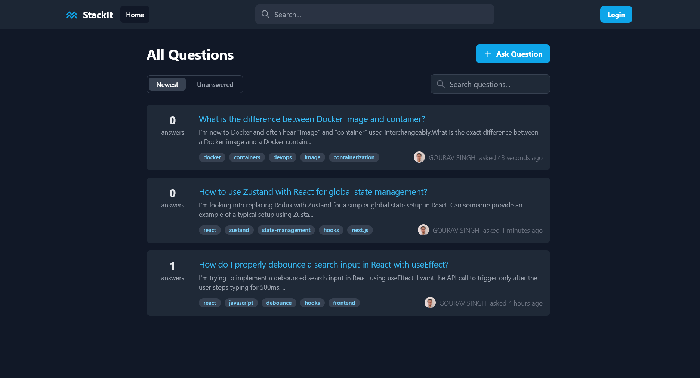
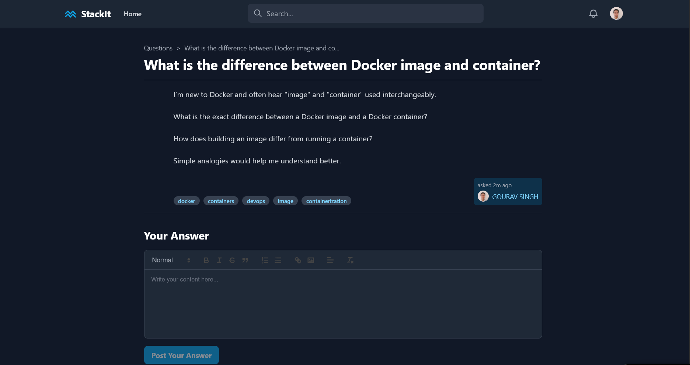
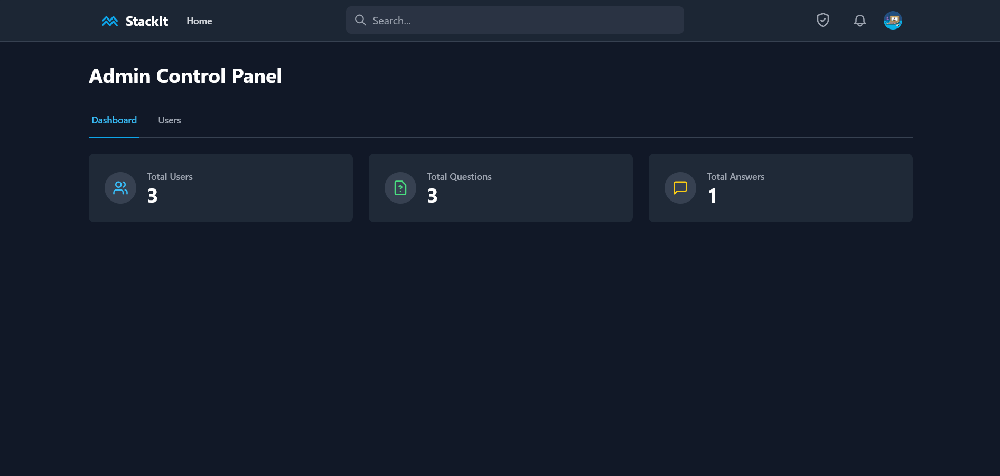

# StackIt - A Full-Stack Q&A Forum

StackIt is a feature-rich, full-stack question-and-answer platform built with the MERN stack (MongoDB, Express, React, Node.js) and integrated with Clerk for modern authentication. It supports collaborative learning and structured knowledge sharing in a simple, user-friendly interface.

## Tech Stack

- **Frontend**: React 18, TypeScript, Vite, Tailwind CSS, React Router, Quill
- **Backend**: Node.js, Express, Mongoose
- **Database**: MongoDB
- **Authentication**: Clerk

---

## Features

- **Full CRUD for Q&A**: Ask, answer, and view questions.
- **Rich Text Editor**: A `what-you-see-is-what-you-get` editor for questions and answers.
- **Voting System**: Upvote and downvote answers to highlight quality content.
- **Accept Answers**: Question authors can mark the best answer.
- **Secure Authentication**: Built-in login, sign-up, and user profile management with Clerk.
- **High-Performance Search**: Full-text search for questions, powered by a MongoDB text index.
- **Server-Side Pagination**: Efficiently browse through thousands of questions.
- **Content Moderation**: Admins can delete inappropriate questions and answers.
- **Admin Control Panel**: A secure area for admins to view platform statistics and manage users.

---

## How to Run This Project (Step-by-Step)

### Prerequisites

1.  **Node.js and npm**: [Install Node.js](https://nodejs.org/) (v18 or newer).
2.  **MongoDB Account**: A free [MongoDB Atlas account](https://www.mongodb.com/cloud/atlas/register) to host your database.
3.  **Clerk Account**: A free [Clerk account](https://dashboard.clerk.com/sign-up) for user authentication.

---

### Step 1: Set Up Clerk

1.  **Create a Clerk Application**:

    - In your Clerk Dashboard, click **"Add application"**.
    - Give it a name (e.g., "StackIt").
    - Select your desired social providers (like Google, GitHub).
    - Click **"Create Application"**.

2.  **Get Your Keys**:
    - Navigate to your new application's dashboard.
    - On the homepage, you will find your **Publishable Key**. Copy it.
    - In the left sidebar, go to **API Keys**. Copy your **Secret Key**.

---

### Step 2: Set Up an Admin User (Required for Admin Panel)

To use the content moderation and admin panel features, you need to designate a user as an admin. This is the **only** step required to grant admin permissions.

1.  **Log in to your app** to create a user account.
2.  Go to your **Clerk Dashboard** and click on **Users** in the sidebar.
3.  **Find and click on the user** you want to make an admin.
4.  Navigate to the **Metadata** tab for that user.
5.  In the **Public Metadata** section, add the following JSON:
    ```json
    {
      "role": "admin"
    }
    ```
6.  Click **"Save Changes"**.

**IMPORTANT**: After assigning the admin role, you **must log out and log back into your application** for the changes to take full effect.

---

### Step 3: Set Up MongoDB Atlas

1.  **Create a Cluster**:
    - In your MongoDB Atlas dashboard, create a new project and then build a new cluster. The free M0 tier is sufficient.
2.  **Get Your Connection String**:

    - Once the cluster is ready, click **"Connect"**.
    - Choose **"Drivers"**.
    - Under "View connection string", copy the string. It will look like: `mongodb+srv://<username>:<password>@...`
    - **Important**: Replace `<password>` with the actual password for the database user you created. You may also need to whitelist your IP address in Atlas under "Network Access".

3.  **Create Text Index (CRITICAL FOR SEARCH)**:
    - After connecting to your cluster, navigate to the **"Collections"** tab.
    - Find your `questions` collection. If it doesn't exist yet, run the backend first to create it.
    - Click on the **"Indexes"** tab for the `questions` collection.
    - Click **"Create Index"**.
    - In the **Fields** configuration, enter the following JSON. This tells MongoDB to create a search index on the `title`, `body`, and `tags` fields.
      ```json
      {
        "title": "text",
        "body": "text",
        "tags": "text"
      }
      ```
    - You can give the index a name, like `QuestionTextIndex`.
    - Click **"Create"**. This step is required for the application's search feature to work correctly.

---

### Step 4: Configure and Run the Backend

1.  **Navigate to the Backend Directory**:
    - Open a terminal in your project's root and go into the `backend` folder:
    ```sh
    cd backend
    ```
2.  **Create Environment File**:
    - Copy the example environment file:
    ```sh
    cp .env.example .env
    ```
3.  **Edit `backend/.env`**:
    - Open the `backend/.env` file and fill in the values you copied.
    ```
    MONGO_URI=your_mongodb_connection_string
    CLERK_SECRET_KEY=your_clerk_secret_key
    CLERK_PUBLISHABLE_KEY=your_clerk_publishable_key
    FRONTEND_URL=http://localhost:5173
    ```
    - **Note**: The `CLERK_PUBLISHABLE_KEY` is the same one you'll use in the frontend.
4.  **Install Dependencies**:
    ```sh
    npm install
    ```
5.  **Start the Backend Server**:
    ```sh
    npm start
    ```
    - The backend will now be running, typically on `http://localhost:4000`. Keep this terminal open.

---

### Step 5: Configure and Run the Frontend

1.  **Open a New Terminal**:
    - Open a **second terminal** in VS Code. Make sure you are in the project's **root directory** (not the `backend` folder).
2.  **Create Environment File**:
    - In the **root** directory, copy the example file:
    ```sh
    cp .env.example .env
    ```
3.  **Edit `/.env` (Root Directory)**:
    - Open the `.env` file in the root and fill in your keys. The API URL should point to your running backend.
    ```
    VITE_CLERK_PUBLISHABLE_KEY=your_clerk_publishable_key
    VITE_API_URL=http://localhost:4000/api
    ```
4.  **Install Dependencies**:
    ```sh
    npm install
    ```
5.  **Run the Frontend App**:
    ```sh
    npm run dev
    ```
    - The frontend will now be running, typically on `http://localhost:5173`.

**You're all set!** Open `http://localhost:5173` in your browser to use the application.

## 📸 Screenshots

<table>
  <tr>
    <td></td>
    <td></td>
  </tr>
  <tr>
    <td></td>
    <td></td>
  </tr>
</table>

## 🎥 Demo Video

[](https://drive.google.com/file/d/18G8vqGSKGsnnVzA0qKO-csb20J9aG4NS/view?usp=sharing)
